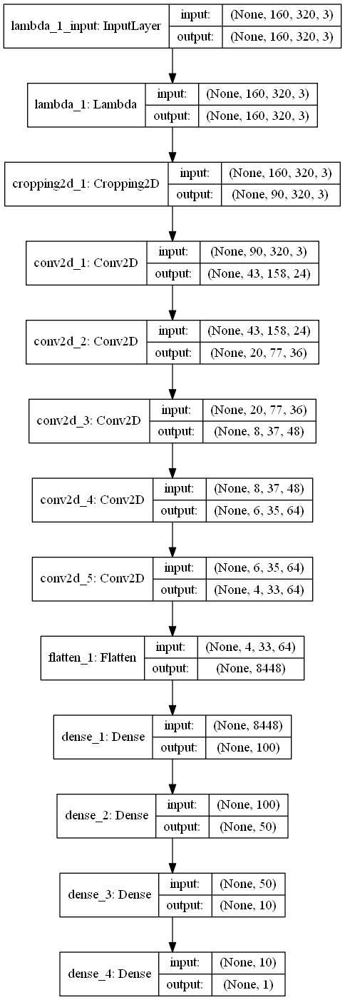

# **Behavioral Cloning** 


---

**Behavioral Cloning Project**

## Goal
The goals / steps of this project are the following:
* Use the simulator to collect data of good driving behavior
* Build, a convolution neural network in Keras that predicts steering angles from images
* Train and validate the model with a training and validation set
* Test that the model successfully drives around track one without leaving the road
* Summarize the results with a written report


[//]: # (Image References)

[image1]: ./examples/placeholder.png "Model Visualization"
[image2]: ./examples/placeholder.png "Grayscaling"
[image3]: ./examples/placeholder_small.png "Recovery Image"
[image4]: ./examples/placeholder_small.png "Recovery Image"
[image5]: ./examples/placeholder_small.png "Recovery Image"
[image6]: ./examples/placeholder_small.png "Normal Image"
[image7]: ./examples/placeholder_small.png "Flipped Image"

## Rubric Points
Here I will consider the [rubric points](https://review.udacity.com/#!/rubrics/432/view) individually and describe how I addressed each point in my implementation.

---
### Files Submitted & Code Quality

#### 1. Submission includes all required files and can be used to run the simulator in autonomous mode

My project includes the following files:
* model.py containing the script to create and train the model
* drive.py for driving the car in autonomous mode
* model.h5 containing a trained convolution neural network 
* writeup_report.md summarizing the results

#### 2. Submission includes functional code
Using the Udacity provided simulator and my drive.py file, the car can be driven autonomously around the track by executing 
```sh
python drive.py model.h5
```

#### 3. Submission code is usable and readable

The model.py file contains the code for training and saving the convolution neural network. The file shows the pipeline I used for training and validating the model, and it contains comments to explain how the code works.

### Model Architecture and Training Strategy

#### 1. An appropriate model architecture has been employed

I implemented the [NVidia Self Driving Car Model](https://devblogs.nvidia.com/parallelforall/deep-learning-self-driving-cars/)
, and the car drove the complete first track after just three training epochs (this model could be found [here](model.py#L10-L123)).

A model summary is as follows:

```
Layer (type)                     Output Shape          Param #     Connected to
====================================================================================================
lambda_1 (Lambda)                (None, 160, 320, 3)   0           lambda_input_2[0][0]
____________________________________________________________________________________________________
cropping2d_1 (Cropping2D)        (None, 90, 320, 3)    0           lambda_1[0][0]
____________________________________________________________________________________________________
convolution2d_1 (Convolution2D)  (None, 43, 158, 24)   1824        cropping2d_1[0][0]
____________________________________________________________________________________________________
convolution2d_2 (Convolution2D)  (None, 20, 77, 36)    21636       convolution2d_1[0][0]
____________________________________________________________________________________________________
convolution2d_3 (Convolution2D)  (None, 8, 37, 48)     43248       convolution2d_2[0][0]
____________________________________________________________________________________________________
convolution2d_4 (Convolution2D)  (None, 6, 35, 64)     27712       convolution2d_3[0][0]
____________________________________________________________________________________________________
convolution2d_5 (Convolution2D)  (None, 4, 33, 64)     36928       convolution2d_4[0][0]
____________________________________________________________________________________________________
flatten_1 (Flatten)              (None, 8448)          0           convolution2d_5[0][0]
____________________________________________________________________________________________________
dense_1 (Dense)                  (None, 100)           844900      flatten_1[0][0]
____________________________________________________________________________________________________
dense_2 (Dense)                  (None, 50)            5050        dense_1[0][0]
____________________________________________________________________________________________________
dense_3 (Dense)                  (None, 10)            510         dense_2[0][0]
____________________________________________________________________________________________________
dense_4 (Dense)                  (None, 1)             11          dense_3[0][0]
====================================================================================================
```

The model includes [RELU layers](model.py#L136-L140) to introduce nonlinearity,
and the data is normalized in the model using a [Keras lambda layer](model.py#L130-L132).

#### 2. Attempts to reduce overfitting in the model

The model contains dropout layers in order to reduce overfitting (model.py lines 21). 

The model was trained and validated on different data sets to ensure that the model was not overfitting,
data was splitted as [80% training and 20% validation](model.py#L25-L30).
The model was tested by running it through the simulator and ensuring that the vehicle could stay on the track.

#### 3. Model parameter tuning

The model used an adam optimizer, so the learning rate was not tuned manually (model.py line 37).

#### 4. Appropriate training data

Training data was chosen to keep the vehicle driving on the road. The simulator provides three different images: center, left and right cameras.
I used the combination of images from all three cameras (center, left, right) was used to train the model,
with correction in the steering measurement for the left and right cameras. The code is [here](model.py#L78-L98)

I also flipped the images, and inverted the steering measurement, to normalize the data.
The code is [here](model.py#L116-L117)

For details about how I created the training data, see the next section. 

### Model Architecture and Training Strategy

#### 1. Solution Design Approach

Based on reading, I learned the [nVidia Autonomous Car Model](https://devblogs.nvidia.com/parallelforall/deep-learning-self-driving-cars/)
is very powerful. Thus I did not bother with other models, and went straight implementing NVidia model.
I added a new layer at the end to have a single output.
The car did not drive well in the simulator autonomous mode, it went off the road.

I augmented the data by filpping the same image and inverted the steering(code [here](model.py#L116-L117)).
I also added more data by adding the left and right camera images and adding a correction factor for the steering to get the car back to the lane([lines 78 - 98](model.py#L78-L98)).
I then cropped off the top and bottom part of the images, as they are irrelevant to steering. ([line 133](model.py#L133))
After processing data, the car drove in the road with the simulartor autonomous mode.

#### 2. Final Model Architecture

Here is a visualization of the architecture (note: visualizing the architecture is optional according to the project rubric)



#### 3. Creation of the Training Set & Training Process

To capture good driving behavior, I first recorded two laps on track one using center lane driving. Here is an example image of training data:

Center camera


Left camera


Right camera


I then recorded the vehicle recovering from the left side and right sides of the road back to center so that the vehicle would learn to get back to the road.
These images show what a recovery looks like:

Off road recover from right


Off road recover from left


I finally randomly shuffled the data set and put 20% of the data into a validation set.

I used this training data for training the model. The validation set helped determine if the model was over or under fitting.
I used an adam optimizer so that manually training the learning rate wasn't necessary.
